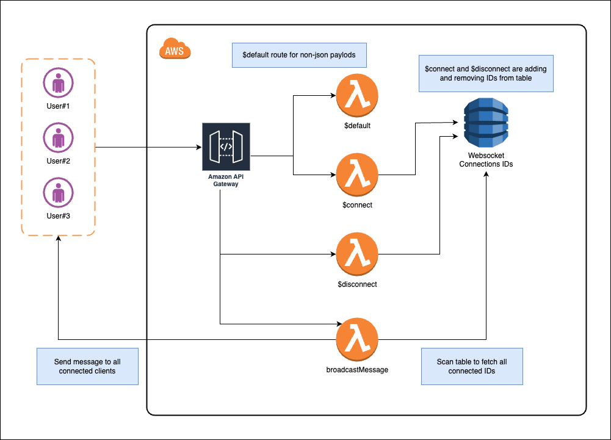

# WebSocket API in Amazon API Gateway

CDK example of:

- WebSocket API using [Amazon API Gateway WebSocketApi Construct](https://docs.aws.amazon.com/cdk/api/v2/docs/@aws-cdk_aws-apigatewayv2-alpha.WebSocketApi.html)
- Using `$connect` and `$disconnect` routes to manage connected users
- Using `AWS.ApiGatewayManagementApi` to send message from backend to connected clients

Final architecture:

Extra resources:

- [About WebSocket APIs in API Gateway](https://docs.aws.amazon.com/apigateway/latest/developerguide/apigateway-websocket-api-overview.html)
- [Managing connected users and client apps: $connect and $disconnect routes](https://docs.aws.amazon.com/apigateway/latest/developerguide/apigateway-websocket-api-route-keys-connect-disconnect.html)
- [Documentation of class: AWS.ApiGatewayManagementApi](https://docs.aws.amazon.com/AWSJavaScriptSDK/latest/AWS/ApiGatewayManagementApi.html)
- [Setup API Gateway WebSocket API with CDK](https://aws.plainenglish.io/setup-api-gateway-websocket-api-with-cdk-c1e58cf3d2be)
- [Process DynamoDB streams with Lambda](https://aws.plainenglish.io/process-dynamodb-streams-with-lambda-5d870455f524)
